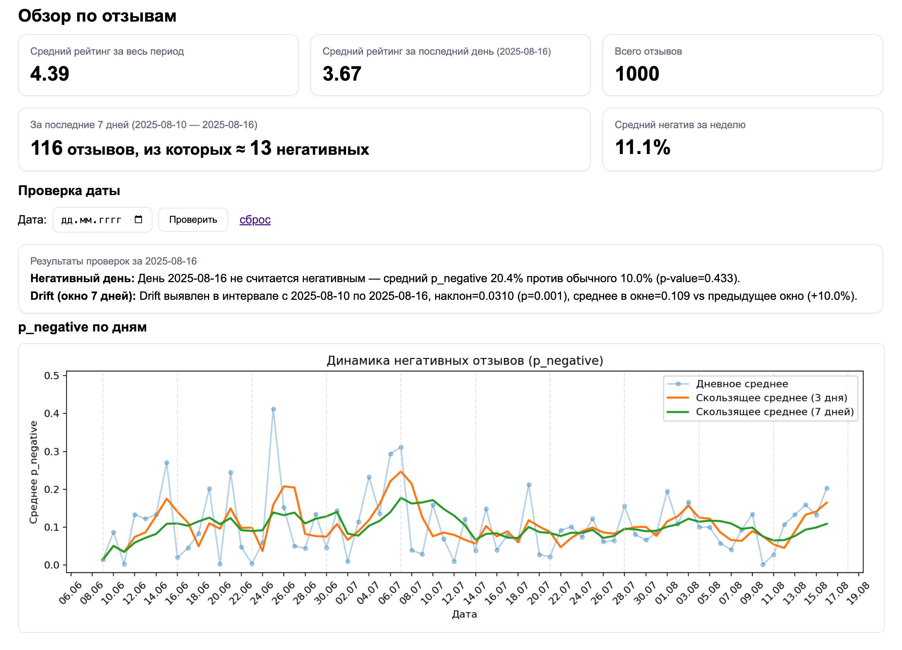

#  Выявление аномалий в динамике оценке отзывов

Проект для **сбора, предобработки и анализа отзывов** по артикулу товара (Wildberries и ) с целью **обнаружения аномалий** в динамике негатива и падения рейтинга. Веб‑интерфейс на FastAPI показывает ключевые метрики и графики, есть API для запуска пайплайна по артикулу.

---

##  Ключевые возможности

*  **Парсинг по артикулу**: автоматический запуск `parser/main.py`, сбор отзывов в `.xlsx` (временный файл).
*  **Предобработка**: чистка текста, нормализация дат/полей.
*  **Сентимент‑анализ**: расчёт вероятности негатива `p_negative` для каждого отзыва (см. `preprocess/sentiment_analysis.py`).
*  **Метрики и графики**: средние рейтинги, недельные агрегаты, график `p_negative` по дням со сглаживанием.
*  **Выявление аномалий**:

  * «Негативные дни» (t‑тест одной выборки),
  * **Drift** в текущем окне по **линейной регрессии** (наклон + t‑критерий),
  * предупреждение при одновременном всплеске негатива и падении рейтинга.


---


##  Архитектура пайплайна

```
┌────────────┐    ┌─────────────────────────┐    ┌─────────────────────┐
│  Артикул   │ -> │ parser/main.py (results)│ -> │ preprocess_dataset  │
└────────────┘    └────────┬────────────────┘    └─────────┬───────────┘
                         (xlsx)                       (clean CSV tmp)
                                          ┌─────────────────▼──────────────────────┐
                                          │sentiment_analysis -> reviews_scored.csv│
                                          └─────────────────┬──────────────────────┘
                                                            │
                                          ┌─────────────────▼────────────────┐
                                          │        FastAPI UI / analysis     │
                                          └──────────────────────────────────┘
```

**Итог:** в репозитории остаётся только `data/reviews_scored.csv`. Папка `parser/results/` очищается после успешной обработки.

---

## 🔬 Методы анализа

1.  **Дневные и недельные метрики**
   - количество отзывов,  
   - средняя оценка (`avg_rating`),  
   - доля негативных (`p_negative`),  
   - сглаживания SMA (3 и 7 дней).  

2.  **Статистические проверки**
   - t-тест одной выборки для выявления “негативных дней” (сравнение `p_negative` текущего дня с историческим фоном),  
   - контроль статистической значимости (`p-value < 0.05`).  

3.  **Детекция дрейфа (drift detection)**
   - сравнение текущего и предыдущего окна фиксированной длины,  
   - линейная регрессия по текущему окну:  
     - наклон (slope) отражает тренд изменения негатива,  
     - t-тест проверяет значимость тренда,  
   - вычисление относительного изменения среднего (Δ % между окнами).  

4.  **Алармы последнего дня**
   - проверка, стал ли последний день статистически “негативным”,  
   - дополнительная проверка падения среднего рейтинга относительно предыдущего дня.  

---

---

## 🛠 Технологии

- **Язык**: Python 3.11
- **Обработка данных**: Pandas, NumPy, tqdm  
- **Статистический анализ**: SciPy, Scikit-learn  
- **Машинное обучение**:  
  - PyTorch  
  - HuggingFace, Transformers  
  - Модель `sismetanin/rubert-ru-sentiment-RuReviews` для анализа тональности отзывов  
- **Веб-интерфейс**: FastAPI, Pydantic  
- **Инфраструктура и утилиты**: pathlib, dataclasses, argparse, shutil, subprocess  


## Установка и запуск
Перед началом работы убедитесь, что у вас установлен **Google Chrome** (актуальная версия).
Парсер использует `selenium` и `webdriver_manager`, которые автоматически подкачают ChromeDriver.
### 1) Клонировать репозиторий:

```bash
git clone https://github.com/username/project-name.git
cd project-name
```
### 2 Подготовка окружения

```bash
python3.11 -m venv .venv 
source .venv/bin/activate      # macOS/Linux
# .venv\Scripts\activate      # Windows
pip install -r requirements.txt
```

### 2) Запуск сервера

```bash
uvicorn mini_app:app --reload
```
После запуска приложение будет доступно по адресу:
http://127.0.0.1:8000

### 3) Работа в UI

1. Введите артикул → **Запустить**.
2. Дождитесь сообщения об успешной обработке.
3. Смотрите карточки с метриками, «Проверку даты» и график доли негатива.

Скриншот веб-интерфейса: пример визуализации метрик и графиков

---


